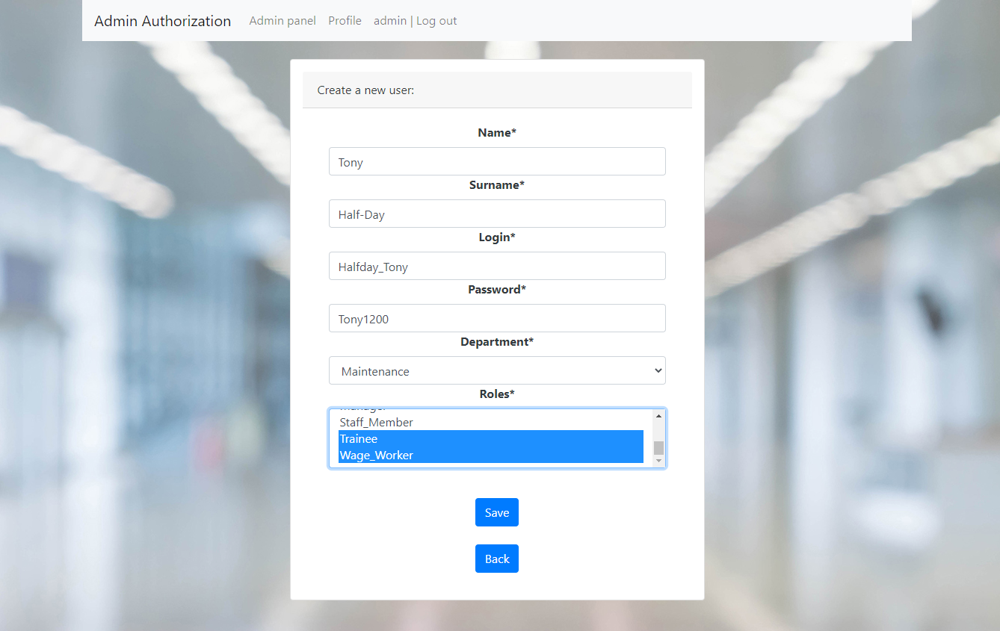

# admin_authorization

# About

- This application is a corporate user authorization system through an administrator account
- The user must request the creation of a new account from the administrator
- The administrator has an admin panel and can register, update and delete a user by login
- After registration, the user can log in using the login and password provided by the administrator
- After logging in, the user can update only following personal data - password, phone, email address and timezone

***

# Used technologies

<ul>
 <li>JDK 17</li>
 <li>Maven 3.8.5</li>
 <li>Lombok 1.18.22</li>
 <li>Spring Boot 2.7.3</li>
 <li>Bootstrap 4.4.1</li>
 <li>Thymeleaf 2.7.3</li>
 <li>JDBC 4</li>
 <li>Hibernate 5.6.11.Final</li>
 <li>PostgreSQL 42.2.27</li>
 <li>Liquibase 4.15.0</li>
</ul>

***

# Environment requirements

<ul>
 <li>Create db "admin_auth". Login: postgres, password: password</li>
 <li>Create .jar file via maven command "mvn package"</li>
 <li>Go to the Target folder and check the presence of "admin_authorization-1.0-SNAPSHOT.jar" file</li>
 <li>Open the command line, go to the Target folder</li>
 <li>Run this file through "java -jar admin_authorization-1.0-SNAPSHOT.jar" command</li>
 <li>Then go to the "http://localhost:8080/index" page</li>
 <li>Log in as admin - login: admin, password: admin1</li>
</ul>

***

# Screenshots

- Login page (user or admin):
  
- Failed log in:
  
- Admin panel (logged in as admin):
  
- User adding:
  
- Successful user adding:
  
- Failed user adding:
  
- Admin index page:
  
- Admin profile:
  
- Admin profile update :
  
- User index page (relogged as user):
  
- User profile:
  
- User profile update:
  
- User profile update by login - login input(relogged as admin):
  
- User profile update by admin:
  
- User profile delete by admin:
  

***

# Todo list

- Add spring security
- Cover the code to unit tests

***

# Contact

Contact me if you have any questions: itfedorovsa@gmail.com

